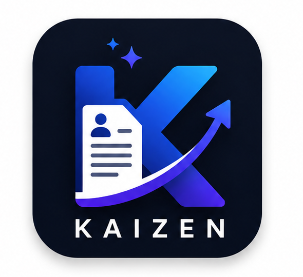

# 🚀 KAIZEN — AI-Powered Resume & Job Application Optimizer

<div align="center">



**Transforming Job Applications with High-Precision ATS Scoring, Smart Resume Tailoring, and AI-Driven Career Automation.**

[](https://github.com/PranshulCSE)
[](https://react.dev/)
[](https://nodejs.org/)
[](https://www.mongodb.com/)
[](https://ai.google.dev/)
[](https://tailwindcss.com/)

</div>

---

## 📌 Table of Contents

- [Overview](#-overview)
- [Key Features](#-key-features)
- [System Architecture](#-system-architecture)
- [Tech Stack](#-tech-stack)
- [Project Directory Structure](#-project-directory-structure)
- [API Reference](#-api-reference)
- [Getting Started & Installation](#-getting-started--installation)
  - [Prerequisites](#prerequisites)
  - [Backend Setup](#1-backend-setup)
  - [Frontend Setup](#2-frontend-setup)
  - [Database Seeding](#3-database-seeding)
- [Environment Configuration](#-environment-configuration)
- [Core Workflows](#-core-workflows)
- [Role-Based Access Control (RBAC)](#-role-based-access-control-rbac)
- [Author & Credits](#-author--credits)
- [License](#-license)

---

## 💡 Overview

**Kaizen** (改善, continuous improvement) is an enterprise-grade, full-stack AI career suite engineered by **[@Pranshul](https://github.com/PranshulCSE)**. It bridges the gap between candidate resumes and modern Applicant Tracking Systems (ATS) used by top tech companies.

Rather than providing generic resume feedback, Kaizen integrates **Google Gemini AI**, **PDF parsing engines**, **real-time web scrapers**, and **GitHub APIs** to deconstruct job postings, quantify candidate achievements, eliminate formatting errors, and produce interview-winning resumes, cover letters, and outreach campaigns.

---

## ✨ Key Features

### 🎯 1. ATS Compatibility Engine & Scoring
- **Algorithmic ATS Simulation**: Analyzes keyword density, hard/soft skills overlap, formatting compliance, and structural readability.
- **Granular Breakdown**: Scores resumes across Keyword Match, Formatting, Experience, Skill, and Education criteria (0–100 scale).
- **Missing Keyword Radar**: Pinpoints exact technical terms and methodologies missing from the candidate's resume.

### ✍️ 2. AI Resume Optimization & Redline Diff
- **Action-Verb & Impact Rewrites**: Converts weak phrases into quantified STAR-format bullet points without fabricating information.
- **Visual Redline Comparison**: Side-by-side interactive before-and-after diff review.
- **Dynamic Skill Suggestion**: Recommends which skills to add, emphasize, or deprioritize.

### 🌐 3. Job Description Scraper & Smart Parsing
- **URL Scraper**: Extracts structured job requirements directly from job posting URLs (LinkedIn, Indeed, company career portals) using Cheerio.
- **Requirement Breakdown**: Automatically categorizes required vs. preferred skills, education levels, role responsibilities, and company culture signals.

### 🐙 4. GitHub Repository Import to Quantified Projects
- **GitHub Sync**: Connects to any GitHub profile (`@username`) and inspects public repositories, languages, stargazers, and topics.
- **AI Resume Project Converter**: Transforms raw code repositories into polished, ATS-compliant technical project bullets.

### ✉️ 5. Career Outreach & Application Kit
- **Tailored Cover Letter Generator**: Generates high-converting cover letters grounded strictly in real resume achievements with customizable tones (Confident, Enthusiastic, Professional, Direct).
- **Cold Outreach Suite**: Crafts LinkedIn InMails, connection notes (under 280 chars), and follow-up templates for hiring managers.
- **AI Interview Prep**: Generates personalized technical, behavioral (STAR), and situational interview questions.

### 📄 6. Dynamic PDF Generation
- **ATS-Optimized Formatting**: Compiles clean, standard single/multi-page PDFs using `@react-pdf/renderer` with strict typography hierarchy.
- **One-Click Download**: Directly exports tailored and optimized resumes to PDF.

### 🛡️ 7. Enterprise Security & Administration
- **Role-Based Access Control**: Multi-tier authentication (`User`, `Admin`, `Super Admin`).
- **Comprehensive Audit Logs**: Tracks administrative actions with timestamps, IP addresses, and user-agent metadata.
- **OTP Verification**: Multi-step email verification for account registration and password resets powered by Nodemailer.

---

## 🏗️ System Architecture

```mermaid
flowchart TD
    subgraph Client["Frontend (React 18 + Vite + TailwindCSS)"]
        UI[User / Admin UI]
        Router[React Router v7]
        State[AuthContext + Axios Client]
    end

    subgraph Gateway["Backend (Node.js + Express API)"]
        AuthMid[JWT & RBAC Middleware]
        RateLimit[Rate Limiter & Helmet]
        Logger[Winston Logger]
    end

    subgraph CoreServices["Business Logic & AI Layer"]
        AIService[Gemini 3.6 Flash Engine]
        Parser[PDF & DOCX Resume Parser]
        PDFGen[@react-pdf Generator]
        Scraper[Cheerio Web Scraper]
        GHService[GitHub REST API Service]
        MailService[Nodemailer SMTP Service]
    end

    subgraph DataStorage["Data & Asset Layer"]
        MongoDB[(MongoDB Atlas / Local)]
        Redis[(Redis Cache - Optional)]
        Cloudinary[(Cloudinary Storage)]
    end

    UI --> Router --> State
    State -->|REST API Requests| Gateway
    Gateway --> AuthMid --> CoreServices
    CoreServices --> MongoDB
    CoreServices --> Redis
    CoreServices --> Cloudinary
    CoreServices --> AIService
```

---

## 🛠️ Tech Stack

### Frontend
| Technology | Version | Purpose |
| :--- | :--- | :--- |
| **React** | `v18.3.1` | Component-driven UI framework |
| **Vite** | `v5.4.11` | Next-generation frontend build tooling |
| **React Router** | `v7.18.2` | Client-side routing and protected routes |
| **TailwindCSS** | `v3.4.17` | Utility-first responsive design styling |
| **Lucide React** | `v0.344.0` | Modern iconography |
| **React Hook Form** | `v7.54.2` | Form validation and state handling |
| **React Dropzone** | `v14.3.5` | Drag-and-drop resume upload handling |
| **React Hot Toast** | `v2.4.1` | Notification toaster |
| **Axios** | `v1.7.9` | HTTP client with automatic token attachment |

### Backend
| Technology | Version | Purpose |
| :--- | :--- | :--- |
| **Node.js** | `>= 18.x` | JavaScript runtime environment |
| **Express.js** | `v4.18.2` | REST API framework |
| **MongoDB / Mongoose** | `v7.0.3` | Schema-based NoSQL database management |
| **Google Generative AI** | `^0.1.3` | Gemini Flash AI model integration |
| **@react-pdf/renderer** | `v3.0.1` | Server-side programmatic PDF generation |
| **pdf-parse & mammoth** | — | Parsing text from `.pdf` and `.docx` files |
| **Cheerio** | `v1.2.0` | Fast HTML parsing for job URL scraping |
| **Cloudinary** | `v1.37.3` | Secure cloud storage for resume uploads |
| **Nodemailer** | `v6.9.1` | Transactional email delivery (OTPs & alerts) |
| **JWT & BcryptJS** | — | Token authentication & password hashing |
| **Winston** | `v3.8.2` | Structured error and request logging |
| **Helmet & Rate Limit** | — | HTTP security headers and API throttling |

---

## 📂 Project Directory Structure

```text
Kaizen/
├── Backend/
│   ├── logs/                      # Winston runtime and error logs
│   ├── src/
│   │   ├── config/                # Database, Cloudinary & Redis configurations
│   │   │   ├── cloudinary.js
│   │   │   ├── database.js
│   │   │   └── redis.js
│   │   ├── controllers/           # Request handlers for API endpoints
│   │   │   ├── adminController.js
│   │   │   ├── aiController.js
│   │   │   ├── authController.js
│   │   │   ├── jobController.js
│   │   │   └── resumeController.js
│   │   ├── middleware/            # Auth, Admin RBAC, Multer & Validator
│   │   │   ├── admin.js
│   │   │   ├── auth.js
│   │   │   ├── upload.js
│   │   │   └── validator.js
│   │   ├── models/                # Mongoose Database Schemas
│   │   │   ├── AuditLog.js
│   │   │   ├── JobAnalysis.js
│   │   │   ├── OTPSchema.js
│   │   │   ├── Resume.js
│   │   │   └── User.js
│   │   ├── routes/                # API Route Definitions
│   │   │   ├── adminRoutes.js
│   │   │   ├── aiRoutes.js
│   │   │   ├── authRoutes.js
│   │   │   ├── jobRoutes.js
│   │   │   └── resumeRoutes.js
│   │   ├── seeders/               # Initial system seeders (SuperAdmin)
│   │   │   └── adminSeeder.js
│   │   ├── services/              # Core business logic & AI orchestration
│   │   │   ├── aiService.js
│   │   │   ├── emailService.js
│   │   │   ├── githubService.js
│   │   │   ├── resumeParser.js
│   │   │   ├── resumePdfService.js
│   │   │   └── scraperService.js
│   │   ├── utils/                 # Constants, helpers, and logger
│   │   │   ├── constant.js
│   │   │   ├── helpers.js
│   │   │   └── logger.js
│   │   └── app.js                 # Express Application instance
│   ├── server.js                  # Entrypoint server script
│   └── package.json
│
├── Frontend/
│   ├── public/                    # Static brand assets
│   ├── src/
│   │   ├── api/                   # Modular Axios API services
│   │   │   ├── admin.api.js
│   │   │   ├── ai.api.js
│   │   │   ├── auth.api.js
│   │   │   ├── axiosClient.js
│   │   │   ├── jobs.api.js
│   │   │   └── resumes.api.js
│   │   ├── components/            # Reusable UI, Layout & Auth Guards
│   │   │   ├── auth/              # Protected & Admin route wrappers
│   │   │   ├── layout/            # Navbar, Sidebar, Footer, AppShell
│   │   │   └── ui/                # Buttons, Inputs, Cards, RedlineDiff, Gauges
│   │   ├── context/               # React Context Providers (AuthContext)
│   │   ├── pages/                 # Full application pages & dashboards
│   │   │   ├── AdminDashboard.jsx
│   │   │   ├── AdminLogs.jsx
│   │   │   ├── AdminUsers.jsx
│   │   │   ├── AnalyzeJob.jsx
│   │   │   ├── CoverLetter.jsx
│   │   │   ├── Dashboard.jsx
│   │   │   ├── GitHubImport.jsx
│   │   │   ├── JobAnalyses.jsx
│   │   │   ├── JobAnalysisDetail.jsx
│   │   │   ├── Landing.jsx
│   │   │   ├── Login.jsx
│   │   │   ├── Optimize.jsx
│   │   │   ├── Register.jsx
│   │   │   ├── ResumeDetail.jsx
│   │   │   ├── Resumes.jsx
│   │   │   └── VerifyOtp.jsx
│   │   ├── App.jsx                # Application Root with Routes & Toaster
│   │   └── main.jsx               # React entry point
│   ├── index.html
│   ├── tailwind.config.js
│   └── package.json
│
└── README.md
```

---

## 📡 API Reference

### 🔐 Authentication (`/api/auth`)
| Method | Endpoint | Description | Auth |
| :--- | :--- | :--- | :--- |
| `POST` | `/register` | Create a new account and dispatch OTP | Public |
| `POST` | `/verify-otp` | Verify 6-digit email OTP code | Public |
| `POST` | `/resend-otp` | Request a fresh OTP code | Public |
| `POST` | `/login` | Authenticate user & return JWT token | Public |
| `POST` | `/refresh-token` | Exchange refresh token for new access token | Public |
| `POST` | `/forgot-password` | Dispatch password reset OTP | Public |
| `POST` | `/reset-password` | Reset password using valid OTP | Public |
| `POST` | `/logout` | Invalidate current session | User |

### 🤖 AI & Optimization (`/api/ai`)
| Method | Endpoint | Description | Auth |
| :--- | :--- | :--- | :--- |
| `POST` | `/analyze-job` | Extract requirements, keywords & culture from job text | User |
| `POST` | `/scrape-job-url` | Scrape job description content directly from URL | User |
| `POST` | `/optimize-resume` | Generate optimized bullets, skill diffs & summary | User |
| `POST` | `/calculate-ats` | Calculate ATS match score & keyword radar | User |
| `POST` | `/generate-questions`| Generate tailored technical & STAR interview questions | User |
| `POST` | `/cover-letter` | Generate customized cover letter with tone presets | User |
| `POST` | `/cold-outreach` | Generate LinkedIn InMail, connection notes & strategy | User |
| `POST` | `/github-repos` | Fetch public repositories for a GitHub username | User |
| `POST` | `/github-bullets` | Convert selected GitHub repos into resume project entries | User |

### 📄 Resume Management (`/api/resumes`)
| Method | Endpoint | Description | Auth |
| :--- | :--- | :--- | :--- |
| `POST` | `/upload` | Upload & parse PDF/DOCX file with Cloudinary backup | User |
| `POST` | `/` | Create manual structured resume entry | User |
| `GET` | `/` | Fetch all resumes for the authenticated user | User |
| `GET` | `/:id` | Fetch resume details by ID | User |
| `PUT` | `/:id` | Update resume content and metadata | User |
| `DELETE`| `/:id` | Delete resume | User |
| `POST` | `/:id/download` | Generate and download compiled ATS PDF | User |

### 🛡️ Admin Management (`/api/admin`)
| Method | Endpoint | Description | Auth |
| :--- | :--- | :--- | :--- |
| `GET` | `/dashboard` | Retrieve platform analytics & usage stats | Admin |
| `GET` | `/users` | List paginated users with filtering | Admin |
| `GET` | `/users/:id` | View detailed user record | Admin |
| `PUT` | `/users/:id/verify` | Manually toggle user email verification | Admin |
| `GET` | `/resumes` | View all platform resumes | Admin |
| `PUT` | `/users/:id/role` | Update user role (`user`, `admin`, `superadmin`) | Super Admin |
| `GET` | `/logs` | Retrieve system audit logs | Super Admin |

---

## 🚀 Getting Started & Installation

### Prerequisites
- **Node.js** (v18.0.0 or higher)
- **MongoDB** (Local instance or MongoDB Atlas cluster)
- **Google Gemini API Key** ([Get it here](https://aistudio.google.com/))
- **Cloudinary Account** (For file asset hosting)
- **SMTP Server** (Gmail, SendGrid, or Mailgun for OTP emails)

---

### 1. Backend Setup

```bash
# 1. Navigate to the backend directory
cd Backend

# 2. Install dependencies
npm install

# 3. Create your environment file
cp .env.example .env   # Or create .env manually (see configuration below)

# 4. Run the seed script to create initial admin account
npm run seed

# 5. Start the development server
npm run dev
```
The backend will launch at `http://localhost:5000`.

---

### 2. Frontend Setup

```bash
# 1. Open a new terminal and navigate to Frontend
cd Frontend

# 2. Install dependencies
npm install

# 3. Launch the Vite development server
npm run dev
```
The web application will be accessible at `http://localhost:5173`.

---

### 3. Database Seeding

To initialize the default SuperAdmin credentials and core collections:

```bash
cd Backend
npm run seed
```

---

## ⚙️ Environment Configuration

Create a `.env` file in `Backend/` with the following parameters:

```env
# Server Configuration
PORT=5000
NODE_ENV=development
FRONTEND_URL=http://localhost:5173

# Database Connection
MONGODB_URI=mongodb://localhost:2717/kaizen

# Redis (Optional Caching)
REDIS_URL=redis://localhost:6379

# JWT Authentication
JWT_SECRET=your_super_secret_jwt_access_key_here
JWT_EXPIRES_IN=7d
JWT_REFRESH_SECRET=your_super_secret_jwt_refresh_key_here
JWT_REFRESH_EXPIRES_IN=30d

# Google Gemini AI
GEMINI_API_KEY=your_gemini_api_key_here
GEMINI_MODEL=gemini-3.6-flash

# Cloudinary Storage
CLOUDINARY_CLOUD_NAME=your_cloudinary_cloud_name
CLOUDINARY_API_KEY=your_cloudinary_api_key
CLOUDINARY_API_SECRET=your_cloudinary_api_secret

# SMTP Email Configuration (Nodemailer)
SMTP_HOST=smtp.gmail.com
SMTP_PORT=587
SMTP_USER=your_email@gmail.com
SMTP_PASS=your_app_specific_password
EMAIL_FROM="Kaizen AI <no-reply@kaizen.ai>"

# Rate Limiting
RATE_LIMIT_WINDOW=15
RATE_LIMIT_MAX=100

# GitHub Integration (Optional - increases rate limits)
GITHUB_TOKEN=your_personal_access_token_here
```

---

## 🔄 Core Workflows

### 1. Resume Optimization Workflow
```text
[Upload PDF/DOCX] ──> [Auto-Parse Text] ──> [Paste Job Posting or URL]
                                                      │
                                                      ▼
[Compiled ATS PDF] <── [Redline Diff Review] <── [Gemini AI Analysis]
```

1. **Upload Resume**: Upload your existing resume. The parser extracts personal information, experience, education, skills, and projects.
2. **Input Target Job**: Paste the job description or enter a live job listing URL.
3. **Analyze & Benchmark**: Gemini extracts required competencies and calculates your real-world ATS compatibility score.
4. **Interactive Redline Diff**: Inspect before/after bullet rewrites and select targeted improvements.
5. **Export**: Generate an ATS-compliant PDF ready for direct submission.

### 2. GitHub Project Import Workflow
```text
[Input @GitHub_Username] ──> [Fetch Public Repos] ──> [Select Top Repos]
                                                              │
                                                              ▼
[Add to Resume Projects] <── [Generate STAR Bullets] <────────┘
```

---

## 👥 Role-Based Access Control (RBAC)

| Role | Permissions |
| :--- | :--- |
| **User** | Upload & manage personal resumes, scrape jobs, run AI optimizations, generate cover letters & outreach kits, export PDFs. |
| **Admin** | All user permissions + access to Admin Dashboard, user management, resume analytics, and verification toggles. |
| **Super Admin** | Full access + role elevation, privilege assignment, and system-wide audit log inspection. |

---

## 👨‍💻 Author & Credits

Developed with ❤️ by **[@Pranshul](https://github.com/PranshulCSE)**.

- **GitHub**: [@PranshulCSE](https://github.com/PranshulCSE)
- **Project**: Kaizen AI Resume & Career Application Suite

---

## 📄 License

This project is licensed under the [ISC License](LICENSE).
Feel free to star ⭐ the repository if you found this helpful!
